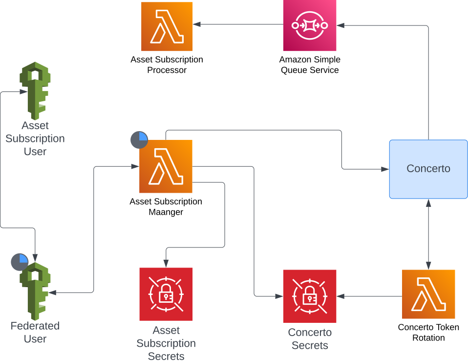

# GraphQL subscription using AWS SQS for serverless application

## What is a GraphQL Subscription

Subscriptions are a GraphQL feature that allows a server to send data to its clients when a specific *event* happens.

i.e. You create a subscription to be notified every time there is a change in the users table of your app. So, every time a user is created, modified or deleted GraphQL will send a "notification" instantly to SQS without needing to make a request for that information.

## Subscriptions using SQS

Subscriptions needs a transport mechanism to tell the client that an event occurred on the server. By implementing a subscription through SQS the transport mechanism is not anymore websockets. A SQS resource must be created in AWS along with the necessary information to write data to that queue. This information are the credentials provided in the header of the subscription request.

From an adapters point of view to create a subscription trough SQS the adapter must:

1. Create an IAM user with permission to send to the queue and permission to created a federated user that will assume the role of the user.
2. Create an SQS queue on AWS with a policy that allows the federated user to send messages ti this queue.
3. Create two secrets manager 'vaults' to store concerto and IAM user credentials.
4. Create lambda to manage the subscription lifecycle.
5. Create a lambda to read the data received from the subscription.

## Project Architecture

## [Deployment](./docs/deployment.md)

## [Configuration](./docs/configuration.md)
